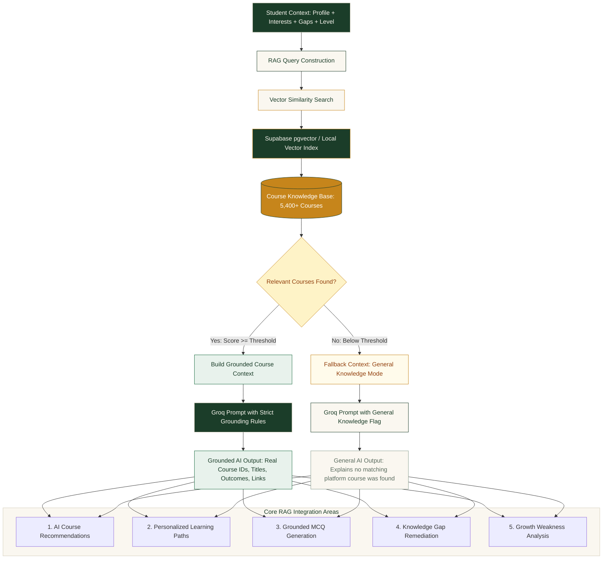

# GyanMarg AI — Adaptive Competency Intelligence & Learning Platform

GyanMarg AI is a closed-loop, competency-driven learning and assessment platform built for official statistical organizations, public data cadres, and research professionals. It establishes a verifiable end-to-end skill progression cycle:

$$\text{Diagnostic Assessment} \longrightarrow \text{AI Gap Analysis} \longrightarrow \text{Personalized Learning Paths} \longrightarrow \text{Document-Grounded Question Synthesis} \longrightarrow \text{Interactive Practice} \longrightarrow \text{Live Skill Health Growth}$$

---

## 1. Core Architecture & Workflow

GyanMarg AI is designed around an unbroken competency loop rather than isolated vanity interfaces:

```
                  +-------------------------------------------------------+
                  |         1. User Authentication & Profile Setup        |
                  +-------------------------------------------------------+
                                              |
                                              v
                  +-------------------------------------------------------+
                  |     2. Interested Courses Onboarding (Calibration)    |
                  +-------------------------------------------------------+
                                              |
                                              v
                  +-------------------------------------------------------+
                  |    3. Baseline Diagnostic Assessment (10 Scenarios)   |
                  +-------------------------------------------------------+
                                              |
                                              v
                  +-------------------------------------------------------+
                  |  4. Automatic Evaluation & Citations (Page-Grounded)  |
                  +-------------------------------------------------------+
                                              |
                                              v
                  +-------------------------------------------------------+
                  |    5. AI Competency Gap Analysis (Dual-Polygon Radar) |
                  +-------------------------------------------------------+
                                              |
                                              v
                  +-------------------------------------------------------+
                  |  6. Gap-Prioritized Recommendations (22 Courses)      |
                  +-------------------------------------------------------+
                                              |
                                              v
                  +-------------------------------------------------------+
                  |   7. Sequenced 4-Phase Learning Path (roadmap.sh)    |
                  +-------------------------------------------------------+
                                              |
                     +------------------------+------------------------+
                     |                                                 |
                     v                                                 v
+------------------------------------------+     +------------------------------------------+
| 8. Admin Ingestion (PDF/DOC Guidelines)  |     | 10. Interactive Practice Knowledge Check |
+------------------------------------------+     +------------------------------------------+
                     |                                                 |
                     v                                                 v
+------------------------------------------+     +------------------------------------------+
| 9. AI Question Synthesizer & HITL Review | --> | 11. Instant Auto-Evaluation & Feedback   |
+------------------------------------------+     +------------------------------------------+
                                                                       |
                                                                       v
                                                 +------------------------------------------+
                                                 | 12. Learner Dashboard & Skill Health (+X)|
                                                 +------------------------------------------+
```

> **Student Onboarding Flow:** After student authentication, GyanMarg guides the learner through an interested-course selection step before entering the student learning dashboard. Course preferences are persisted for personalization, while the onboarding screen is intentionally presented at the start of each demo session.

### 1.1 RAG (Retrieval-Augmented Generation) Architecture

GyanMarg AI integrates an end-to-end Retrieval-Augmented Generation (RAG) engine grounded in the official 5,400+ iGOT Karmayogi course catalog to prevent LLM hallucinations, guarantee real course links, and dynamically personalize learning:



#### RAG Execution Stages

1. **Student Context Aggregation**: Collects learner profile, selected domains, diagnosed competency gaps (e.g. 40% deficit in Statistics), and current level.
2. **Semantic Query Construction**: Translates student deficits and learning goals into dense semantic search terms.
3. **Vector Similarity Search**: Executes high-dimensional vector search against the 5,400+ course knowledge base using Supabase `pgvector` (HNSW indexing with cosine distance) with local in-memory cosine fallback.
4. **Anti-Hallucination Grounding Gate**:
   - **Score $\ge$ Threshold ($\ge 0.65$)**: Injects strictly grounded course metadata (exact IDs, real titles, verified durations, and URLs) into Groq LLM context (`llama-3.3-70b-versatile`). The LLM is constrained to only reference existing courses.
   - **Score $<$ Threshold**: Shifts into transparent General Knowledge Mode, advising the learner that no exact catalog course covers this niche while providing foundational guidance without inventing fake course IDs.
5. **Multi-Domain Downstream Integration**: Drives 5 platform capabilities:
   - **AI Course Recommendations**: Ranked catalog suggestions directly addressing user-specific deficits.
   - **Personalized Learning Paths**: 4-phase milestone roadmaps populated with real course prerequisites.
   - **Grounded MCQ Generation**: Practice quizzes linked to exact chapters, documents, and syllabus modules.
   - **Knowledge Gap Remediation**: Direct 1-click remediation paths on the student dashboard.
   - **Growth Weakness Analysis**: Longitudinal skill tracking and targeted study suggestions.

---

## 2. The Core MVP Features

All Core MVP features defined in the engineering specifications are 100% implemented, integrated, and verified:

| # | Feature | Description | Primary Source |
| :-: | :--- | :--- | :--- |
| **1** | **User Authentication & Course Onboarding** | Role-based routing (`student` vs `admin`), email/password authentication, live Google OAuth 2.0, 1-click Demo switchers, and mandatory course interest calibration onboarding (`/student/interested-courses`). | `src/context/AuthContext.tsx`, `src/pages/Login.tsx`, `src/pages/student/InterestedCourses.tsx` |
| **2** | **Competency Assessment Interface** | 10 realistic multi-stage sampling, SQL windowing, and data ethics scenarios with a 20-minute countdown timer and navigation grid. | `src/pages/student/Assessment.tsx` |
| **3** | **AI Competency Gap Analysis** | Dynamic $\text{Gap} = \max(0, \text{Target} - \text{Current})$ formula, multi-axis Recharts dual-polygon RadarChart, Gap Variance BarChart, and Gap Matrix Table. | `src/pages/student/GapAnalysis.tsx` |
| **4** | **Document Ingestion Workstation** | Administration workstation supporting PDF and DOC ingestion with chapter parsing, Table of Contents inspection, and metadata tracking. | `src/pages/admin/AssessmentManagement.tsx` |
| **5** | **AI Question Synthesizer & HITL** | Automated question synthesis producing questions with exact document, chapter, and page citations, with inline Human-in-the-Loop approval/rejection. | `src/pages/admin/AssessmentManagement.tsx` |
| **6** | **Interactive Learning Interface** | Course delivery workstation for all 22 courses with syllabus navigation, instructional lectures, study notes, and embedded knowledge checks. | `src/pages/student/LearningInterface.tsx` |
| **7** | **Instant Auto-Evaluation & Citations** | Instant scoring engine displaying percentage mastery, correct answer highlights, technical explanations, and verifiable page citations. | `src/pages/student/AssessmentResults.tsx` |
| **8** | **Personalized Course Recommendations** | Gap-prioritized course sorting that automatically places courses bridging the user's largest measured deficit first, with explicit gap justification banners. | `src/pages/student/CourseDiscovery.tsx` |
| **9** | **Curated Capacity-Building Catalog** | 22 civil service capacity-building courses across 5 competency domains, featuring NSSTA TPAC endorsement badges. | `src/data/igotCourses.ts`, `src/pages/student/CourseDetails.tsx` |
| **10**| **Learner Progress Dashboard** | Human-designed, uncluttered student command center with "Jump Back In" hero card, unified 4-stat KPI row, interactive course tabs, and clean competency comparison chart. | `src/pages/student/Dashboard.tsx` |
| **11**| **Interactive Learning Path Roadmaps** | Visual flowchart roadmap inspired by roadmap.sh, featuring an SVG connecting spine, milestone anchor hubs, subtopic chips, and a slide-out inspector drawer. | `src/pages/student/LearningPath.tsx` |
| **12**| **Centralized i18n Internationalization** | Modular translation engine supporting English (`en`), Hindi (`hi`), Telugu (`te`), and Tamil (`ta`), with zero-refresh reactive switching, English fallback, and accessible multi-language selector. | `src/i18n/`, `src/context/LanguageContext.tsx`, `src/components/LanguageSelector.tsx` |
| **13**| **Interactive Game-Style Guided Tutorial** | 6-stage quest tour onboarding with SVG spotlight mask cutout, pulsing amber frame, quest cards with XP progress bar, keyboard navigation, and celebratory completion screen. | `src/components/tutorial/`, `src/context/TutorialContext.tsx`, `src/layouts/PublicLayout.tsx` |
| **14**| **RAG Vector Search & Anti-Hallucination Engine** | End-to-end semantic vector retrieval engine built on Supabase `pgvector` and 5,400+ official iGOT Karmayogi courses with cosine distance similarity ranking, strict grounding gates, and zero-hallucination fallback. | `src/services/rag/ragService.ts`, `src/services/rag/courseVectorStore.ts`, `supabase/migrations/20260911_rag_pgvector_setup.sql` |

---

## 3. Technology Stack

- **Frontend Core:** React 19, TypeScript, Vite 8
- **Styling & Design Tokens:** Vanilla CSS design token system (`src/tokens.ts`, `src/index.css`) with warm parchment (`#EDE8D8`), deep forest green (`#1B3D29`), and golden amber (`#C6851B`) accents
- **RAG & Vector Retrieval:**
  - **Vector Database:** Supabase `pgvector` extension with HNSW indexing and cosine similarity operator (`<=>`)
  - **Vector Store & Indexer:** `src/services/rag/courseVectorStore.ts` with local embedding fallback and persistent in-memory vector cache
  - **Knowledge Base:** 5,400+ indexed official iGOT Karmayogi catalog courses across governance, statistical, and technology competencies
  - **Anti-Hallucination Pipeline:** Dual-mode threshold gate (`src/services/rag/ragService.ts`) enforcing catalog-grounded generation or explicit fallback
- **LLM Reasoning & Question Synthesis:**
  - **Groq API:** Ultra-fast inference with `llama-3.3-70b-versatile` and `mixtral-8x7b-32768`
  - **Strict Grounding:** Prompt system enforcing verifiable course IDs, syllabus citations, and structured JSON schemas
- **Internationalization (i18n):** Type-safe centralized dictionary engine with English fallback and parameter interpolation
- **Interactive Tour Engine:** Custom game-style guided tutorial with SVG mask spotlight, dynamic viewport clamping, and smooth scroll orchestration
- **Data Visualizations:** Recharts (Dual-polygon RadarChart, Competency Comparison BarChart, AreaChart)
- **Backend & Authentication:** Supabase JavaScript Client (`@supabase/supabase-js`) with active session management and Google OAuth 2.0
- **State Architecture:** Unified Reactive Context Store (`src/context/CompetencyContext.tsx`, `src/context/TutorialContext.tsx`, `src/context/LanguageContext.tsx`) with zero-loss `localStorage` state persistence across sessions

---


## 4. Production Build & Quality Verification

To run a production compilation:
```bash
npm run build
```
Expected output:
```text
vite v8.2.2 building client environment for production...
transforming...
✓ 727 modules transformed.
rendering chunks...
✓ built in ~520ms (0 errors, 0 warnings)
```

---

## 5. End-to-End Demonstration Flow (5-Minute Tour)

1. **Sign In / Demo Access:**
   - Navigate to `http://localhost:8443/login`.
   - Click "⚡ Demo Account (Student)" or sign in via Google OAuth.
2. **Take Baseline Assessment:**
   - Navigate to `http://localhost:8443/student/assessment`.
   - Use "⚡ Demo Quick-Fill" and click "Submit Assessment".
   - Observe instant scoring with exact MoSPI manual page citations.
3. **Analyze Competency Gaps:**
   - Navigate to `http://localhost:8443/student/gap-analysis`.
   - Inspect the dual-polygon Radar Chart comparing your demonstrated score vs. the benchmark.
4. **Explore the roadmap.sh Learning Path:**
   - Navigate to `http://localhost:8443/student/learning-path`.
   - Inspect the connected milestone hubs, subtopic tags, and click any node to open the slide-out Inspector Drawer.
5. **Admin Ingestion & AI Question Generation:**
   - Navigate to `http://localhost:8443/admin/assessments`.
   - Tab 2: Inspect ingested manuals and Table of Contents outlines.
   - Tab 3: Synthesize questions using the AI Question Synthesizer.
   - Tab 1: Approve questions in the Human-in-the-Loop review dashboard.
6. **Complete the Closed Loop (Practice & Growth):**
   - Navigate to `http://localhost:8443/student/courses/1/learn`.
   - Click "Interactive Knowledge Check" in the syllabus.
   - Submit the quiz and observe your score growth (e.g. `45% → 75% (+30 pts)`).
   - Return to `http://localhost:8443/student/dashboard` to verify your updated Composite Skill Health Score!

---

## 6. Project Documentation

Comprehensive architectural and engineering protocols are maintained in the [`project details/`](./project%20details/) directory:

- **[`RULES.md`](./project%20details/RULES.md):** 54 non-negotiable engineering protocols, naming conventions, and testing verification rules.
- **[`CONTEXT.md`](./project%20details/CONTEXT.md):** Active operational context (17 mandatory sections).
- **[`MEMORY.md`](./project%20details/MEMORY.md):** Chronological milestone log detailing Phases A through E.
- **[`PHASES.md`](./project%20details/PHASES.md):** Phased development roadmap.
- **[`MVP_FEATURES.md`](./project%20details/MVP_FEATURES.md):** 11 Core MVP features specification and verification matrix.
- **[`DESIGN.md`](./project%20details/DESIGN.md):** Design token hierarchy, typography, and UX guidelines.
- **[`Architecture.md`](./project%20details/Architecture.md):** Technical and data architecture specifications.

---

## 7. License & Notice

© 2026 GyanMarg AI. All rights reserved.  
Built strictly as an independent personal competency intelligence project adhering to established learning science standards.
