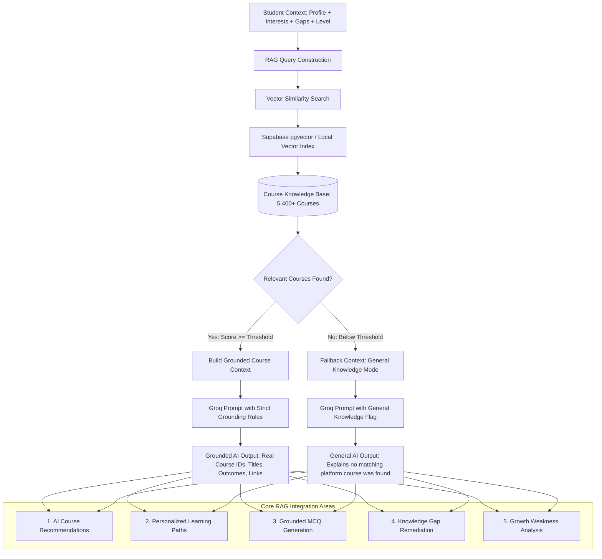

# Project Architecture

## 1. Architecture Overview

The project is an AI-powered competency development and personalized
learning platform designed around two primary user-facing modules:

-   **Student Module** --- enables students to assess their
    competencies, identify skill gaps, follow personalized learning
    paths, track progress, earn certificates, and interact with an AI
    assistant.
-   **Mentor Module** --- enables mentors to manage assigned students,
    monitor competency and learning progress, review skill gaps, provide
    feedback, and use AI-assisted insights for mentoring.

The platform follows a modular architecture centered on **Next.js**,
**Supabase**, **PostgreSQL with pgvector**, **Supabase Edge Functions**,
**Supabase Storage**, **RAG**, and the **Groq API** for LLM inference.

### Core architectural principle

> **Application logic calculates → RAG retrieves → AI
> interprets/generates → Backend validates/enforces → Database stores.**

This separation keeps deterministic operations explainable while using
AI where natural-language reasoning and personalization provide value.

------------------------------------------------------------------------

## 2. High-Level Architecture

<p align="center">
  
</p>

``` text
                                  ┌───────────────────────┐
                                  │         USERS         │
                                  │                       │
                                  │ Students | Mentors    │
                                  │         | Admins      │
                                  └───────────┬───────────┘
                                              │
                                              ▼
                         ┌─────────────────────────────────────┐
                         │          PRESENTATION LAYER         │
                         │             Next.js / React         │
                         │                                     │
                         │  ┌────────────────┐ ┌─────────────┐ │
                         │  │ Student Module │ │Mentor Module│ │
                         │  │                │ │             │ │
                         │  │ Dashboard      │ │ Dashboard   │ │
                         │  │ Profile        │ │ Students    │ │
                         │  │ Assessments    │ │ Progress    │ │
                         │  │ Competencies   │ │ Skill Gaps  │ │
                         │  │ Skill Gaps     │ │ Mentoring   │ │
                         │  │ Learning Path  │ │ Feedback    │ │
                         │  │ Progress       │ │ Reports     │ │
                         │  │ Certificates   │ │ AI Insights │ │
                         │  │ AI Assistant   │ │             │ │
                         │  └────────────────┘ └─────────────┘ │
                         └──────────────────┬──────────────────┘
                                            │
                                      HTTPS / API
                                            │
                                            ▼
┌────────────────────────────────────────────────────────────────────────────┐
│                              SUPABASE                                      │
│                                                                            │
│  ┌──────────────┐  ┌─────────────────────┐  ┌───────────────────────────┐ │
│  │ Supabase Auth│  │ PostgreSQL + pgvector│  │ Supabase Storage          │ │
│  │              │  │                     │  │                           │ │
│  │ Login        │  │ Users & Profiles    │  │ Documents                 │ │
│  │ Sessions     │  │ Assessments         │  │ Videos                    │ │
│  │ JWT          │  │ Skills              │  │ Certificates              │ │
│  │ Roles        │  │ Competencies        │  │ Learning Files            │ │
│  └──────────────┘  │ Learning Progress   │  │ Profile Images             │ │
│                    │ Embeddings          │  └───────────────────────────┘ │
│                    │ RLS                 │                                │
│                    └──────────┬──────────┘                                │
│                               │                                           │
│  ┌────────────────────────────▼─────────────────────────────────────────┐ │
│  │                         EDGE FUNCTIONS                               │ │
│  │                                                                      │ │
│  │ Student Services | Mentor Services | AI Gateway | RAG Pipeline      │ │
│  │ Document Processing | Embeddings | Notifications | Certificates     │ │
│  └────────────────────────────┬─────────────────────────────────────────┘ │
└───────────────────────────────┼────────────────────────────────────────────┘
                                │
                                ▼
                    ┌────────────────────────────┐
                    │          AI LAYER          │
                    │                            │
                    │    AI Orchestrator        │
                    │       /       \            │
                    │      /         \           │
                    │    RAG         AI Services │
                    │     │             │       │
                    │     ▼             ▼       │
                    │  pgvector      Groq API   │
                    │                    │       │
                    │                    ▼       │
                    │                   LLM      │
                    └────────────────────────────┘
```

------------------------------------------------------------------------

## 3. Architecture Layers

### Layer 1 --- Presentation Layer

**Technology:** Next.js / React

The presentation layer provides the web interface and separates the
experience according to the authenticated user's role.

#### Student Module

The Student Module provides:

-   **Interested Courses / Course Selection Onboarding** (`/student/interested-courses`)
-   Dashboard (`/student/dashboard`)
-   Student profile
-   Competency assessment
-   Competency profile
-   Skill-gap analysis
-   Personalized learning path
-   Courses and learning resources
-   Learning progress
-   Certificates and achievements
-   AI assistant

##### Student Authentication & Onboarding Lifecycle

```text
                    ┌─────────────────────┐
                    │   Student Login     │
                    └──────────┬──────────┘
                               │
                               ▼
                    ┌─────────────────────┐
                    │ Authentication      │
                    │ Successful          │
                    └──────────┬──────────┘
                               │
                               ▼
                    ┌─────────────────────┐
                    │ Interested Courses  │
                    │ / Onboarding        │
                    └──────────┬──────────┘
                               │
                               ▼
                    ┌─────────────────────┐
                    │ Save Course         │
                    │ Preferences         │
                    └──────────┬──────────┘
                               │
                               ▼
                    ┌─────────────────────┐
                    │ Student Dashboard   │
                    │ / Student Layout    │
                    └─────────────────────┘
```

##### Persistent Student Data vs. Demo Session Onboarding State

The platform strictly decouples persistent learning profile data from demo presentation state:
- **Persistent Student Data:** Stored in Supabase (`auth.users.raw_user_meta_data.interested_courses` via `supabase.auth.updateUser`) and cached in persistent local storage (`gyanmarg_course_prefs_{userId}`). Stored preferences are never deleted when a session ends and are pre-populated into the selection UI when returning.
- **Demo Session Onboarding State:** Tracked in `sessionStorage` (`gyanmarg_onboarding_completed_{userId}`). In the SIH demo and testing environment, every new browser session or sign-in resets this session token, guaranteeing that evaluators always experience the course selection onboarding interface before entering the dashboard.

#### Mentor Module

The Mentor Module provides:

-   Mentor dashboard
-   Assigned student management
-   Student profiles
-   Student competency overview
-   Student assessment results
-   Student skill-gap analysis
-   Learning progress monitoring
-   Mentoring and guidance
-   Mentor feedback
-   Recommendations
-   Reports
-   Communication
-   AI-assisted insights

The two modules use the same platform and backend but expose different
functionality according to the user's role and permissions.

------------------------------------------------------------------------

## 4. Authentication and Authorization

**Technology:** Supabase Auth + PostgreSQL + Row Level Security (RLS)

Supabase Auth handles:

-   Student registration and login
-   Mentor registration and login
-   Session management
-   JWT-based authentication
-   Identity management
-   Role identification

Authorization is enforced through application-level role checks and
PostgreSQL Row Level Security policies.

### Role model

``` text
Super Admin
    │
    ├── Platform / Organization Administration
    │
    ├── Mentor
    │      │
    │      └── Assigned Students
    │
    └── Student
           │
           └── Own Profile, Assessments, Learning and Progress
```

### Access model

  -----------------------------------------------------------------------
  Role                                Primary Access
  ----------------------------------- -----------------------------------
  Student                             Own profile, assessments, skill
                                      gaps, learning path, progress,
                                      certificates

  Mentor                              Assigned students and permitted
                                      student competency/progress
                                      information

  Admin                               Organization/platform-level
                                      management

  Super Admin                         Full platform administration
  -----------------------------------------------------------------------

RLS ensures that access restrictions are enforced at the database level
rather than relying only on frontend controls.

------------------------------------------------------------------------

## 5. Backend Architecture

**Technology:** Supabase Edge Functions

Supabase provides the backend platform. Edge Functions act as the
server-side application and orchestration layer for operations that
require business logic, privileged access, external APIs, or AI
processing.

### Student services

``` text
Student Services
├── Assessment Processing
├── Assessment Result Processing
├── Competency Evaluation
├── Skill-Gap Calculation
├── Learning Progress
└── Student-specific AI Requests
```

### Mentor services

``` text
Mentor Services
├── Student Assignment
├── Student Progress Analysis
├── Skill-Gap Review
├── Mentor Feedback
├── Mentoring Recommendations
└── Mentor-specific AI Requests
```

### Shared services

``` text
Shared Services
├── AI Gateway
├── RAG Pipeline
├── Document Processing
├── Embedding Generation
├── Notifications
└── Certificate Generation
```

------------------------------------------------------------------------

## 6. Database Architecture

**Technology:** PostgreSQL

PostgreSQL is the primary system of record.

The database stores structured application data such as:

-   Users
-   Profiles
-   Roles
-   Departments/organizations
-   Student-mentor relationships
-   Assessments
-   Questions
-   Responses
-   Assessment results
-   Skills
-   Competencies
-   Proficiency levels
-   Skill gaps
-   Courses
-   Learning resources
-   Learning paths
-   Learning progress
-   Mentor feedback
-   Certificates
-   Achievements
-   AI conversation metadata
-   Knowledge-base metadata

### Logical data relationships

``` text
User
 │
 ├── Profile
 │
 ├── Role
 │
 ├── Assessments
 │      ├── Questions
 │      └── Responses
 │
 ├── Competency Profile
 │      ├── Skills
 │      └── Competencies
 │
 ├── Skill Gaps
 │
 ├── Learning Path
 │      ├── Courses
 │      └── Learning Resources
 │
 ├── Learning Progress
 │
 ├── Certificates
 │
 └── Achievements
```

------------------------------------------------------------------------

## 7. Competency and Assessment Engine

The assessment and competency system should use deterministic
application logic wherever possible.

### Assessment flow

``` text
Student
   │
   ▼
Assessment
   │
   ▼
Questions
   │
   ▼
Responses
   │
   ▼
Scoring Engine
   │
   ▼
Skill Scores
   │
   ▼
Competency Scores
```

### Skill-gap calculation

``` text
Required Proficiency
        +
Current Proficiency
        │
        ▼
Gap Calculation
        │
        ▼
Priority / Severity
        │
        ▼
Skill Gap Record
```

For example:

``` text
Skill             Current     Required     Gap
------------------------------------------------
SQL                  2            4         2
Python               3            4         1
Statistics           4            4         0
```

The calculation should be transparent and reproducible rather than
delegated entirely to an LLM.

------------------------------------------------------------------------

## 8. Student--Mentor Architecture

Student and Mentor modules form a continuous development loop.

``` text
                 STUDENT
                    │
                    ▼
               Assessment
                    │
                    ▼
               Skill-Gap
                    │
             ┌──────┴──────┐
             ▼             ▼
      AI Recommendation   Mentor Review
             │             │
             └──────┬──────┘
                    ▼
             Learning Plan
                    │
                    ▼
                 Learning
                    │
                    ▼
                Reassess
                    │
                    ▼
              Updated Gap
                    │
                    ▼
                 Mentor
                    │
                    ▼
             Feedback / Guide
```

This creates the platform's continuous learning cycle:

**Assess → Identify Gap → AI Recommend → Mentor Guide → Learn → Reassess
→ Improve**

------------------------------------------------------------------------

## 9. AI Architecture

The AI system is separated from the core application logic.

### AI components

``` text
AI System
│
├── AI Orchestrator
│
├── RAG Service
│   ├── Chunking
│   ├── Embedding Generation
│   ├── Retrieval
│   ├── Similarity Search
│   └── Context Construction
│
├── AI Services
│   ├── Assessment Generation
│   ├── Skill-Gap Explanation
│   ├── Learning Recommendations
│   ├── Personalized Learning Path
│   ├── Content Summarization
│   └── Career / Learning Guidance
│
└── AI Assistant
    ├── Student Q&A
    ├── Mentor Support
    ├── Explanations
    └── Guidance
```

The AI Orchestrator receives the task, gathers the appropriate
application and RAG context, calls the selected AI service, and returns
a structured result to the backend.

------------------------------------------------------------------------

## 10. Groq API Integration

**Technology:** Groq API

Groq is used as the LLM inference provider.

The frontend should never directly expose the Groq API key.

### Secure request flow

``` text
Next.js
   │
   ▼
Supabase Edge Function
   │
   ├── Authenticate user
   ├── Validate permissions
   ├── Collect application context
   ├── Retrieve RAG context
   └── Construct prompt
          │
          ▼
       Groq API
          │
          ▼
         LLM
          │
          ▼
   Structured AI result
          │
          ▼
Supabase / Next.js
```

Groq credentials should be stored as server-side secrets and accessed
only by trusted backend functions.

------------------------------------------------------------------------

## 11. RAG Architecture

Retrieval-Augmented Generation (RAG) grounds AI responses in
project-specific and approved knowledge.

### Why RAG is used

RAG allows the platform to retrieve relevant information from:

-   Competency frameworks
-   Skill definitions
-   Job-role requirements
-   Courses
-   Training materials
-   Documents
-   Policies
-   Government guidelines
-   FAQs
-   Learning resources

The LLM then generates its response using retrieved context instead of
relying only on its pretrained knowledge.

------------------------------------------------------------------------

## 12. RAG Knowledge Ingestion Pipeline

``` text
Admin / Content Manager
          │
          ▼
Upload Document / Learning Material
          │
          ▼
Supabase Storage
          │
          ▼
Edge Function
          │
          ▼
Text / Transcript Extraction
          │
          ▼
Cleaning and Normalization
          │
          ▼
Chunking
          │
          ▼
Embedding Generation
          │
          ▼
PostgreSQL + pgvector
```

For videos, the pipeline can use transcripts or extracted text rather
than repeatedly sending the complete video to an LLM.

------------------------------------------------------------------------

## 13. RAG Retrieval Pipeline & Decision Architecture



``` text
Student Context: Profile + Interests + Gaps + Level
                  │
                  ▼
       RAG Query Construction
                  │
                  ▼
       Vector Similarity Search
                  │
                  ▼
  Supabase pgvector / Local Vector Index
                  │
                  ▼
Course Knowledge Base: 5,400+ Courses
                  │
                  ▼
       Relevant Courses Found?
         /                 \
 Yes (Score >= Threshold)   No (Below Threshold)
        │                             │
        ▼                             ▼
Build Grounded Context      Fallback: General Knowledge Mode
        │                             │
        ▼                             ▼
Groq (Strict Grounding)     Groq (General Knowledge Flag)
        │                             │
        ▼                             ▼
Grounded AI Output          General AI Advisory
(Real Course IDs, Links)    (Explains no catalog match)
        │                             │
        └──────────────┬──────────────┘
                       │
       ┌───────────────┼───────────────┬───────────────┬───────────────┐
       ▼               ▼               ▼               ▼               ▼
1. AI Course    2. Learning     3. Grounded     4. Knowledge    5. Growth
Recommendations    Paths           MCQs            Gaps         Weaknesses
```

The same RAG infrastructure supports Student, Mentor, and Assessment modules with strict anti-hallucination guarantees and role-filtered context.

------------------------------------------------------------------------

## 14. Vector Storage

**Technology:** PostgreSQL + pgvector

A separate vector database is not required for the initial architecture.

The platform can store embeddings alongside application and knowledge
metadata using PostgreSQL with pgvector.

### Vector data

``` text
pgvector
│
├── Document Embeddings
├── Course Embeddings
├── Skill Embeddings
├── Competency Embeddings
└── Knowledge Embeddings
```

This keeps the initial system simpler and reduces infrastructure
overhead.

------------------------------------------------------------------------

## 15. Personalized Learning Architecture

Personalized learning combines deterministic competency data with AI and
RAG.

``` text
Student Profile
      +
Assessment Results
      +
Current Competencies
      +
Skill Gaps
      +
Career / Learning Goals
      +
Learning History
      │
      ▼
Competency & Recommendation Engine
      │
      ▼
RAG Retrieval
      │
      ▼
Relevant Courses / Resources
      │
      ▼
Groq LLM
      │
      ▼
Personalized Learning Path
      │
      ▼
PostgreSQL
      │
      ▼
Student Dashboard
```

The recommendation system can prioritize resources based on:

-   Skill gap severity
-   Required proficiency
-   Current proficiency
-   Learning history
-   Course difficulty
-   Learning objectives
-   Role requirements
-   Mentor feedback

------------------------------------------------------------------------

## 16. Mentor AI Insights

The Mentor Module can use AI to transform student data into actionable
insights.

``` text
Mentor
  │
  ▼
Select Assigned Student
  │
  ▼
Edge Function
  │
  ├── Assessment History
  ├── Competency Profile
  ├── Skill Gaps
  ├── Learning Progress
  ├── Previous Mentor Feedback
  └── Relevant RAG Knowledge
          │
          ▼
       Groq API
          │
          ▼
      AI Analysis
          │
          ▼
Mentor Insights / Recommendations
```

The AI assists the mentor but does not replace human mentoring
decisions.

------------------------------------------------------------------------

## 17. AI Assistant Architecture

The AI Assistant is shared conceptually across both modules but uses
role-specific context.

### Student assistant

``` text
Student Question
      │
      ▼
Student Context
      +
Competency Context
      +
Learning Context
      +
RAG Context
      │
      ▼
Groq LLM
      │
      ▼
Personalized Answer
```

### Mentor assistant

``` text
Mentor Request
      │
      ▼
Assigned Student Context
      +
Competency Context
      +
Progress Context
      +
RAG Context
      │
      ▼
Groq LLM
      │
      ▼
Mentor Insight
```

------------------------------------------------------------------------

## 18. Supabase Storage Architecture

Supabase Storage is used for file and media objects.

### Stored content

-   Learning documents
-   PDFs
-   Training files
-   Video files
-   Certificate files
-   Profile images
-   Other approved learning resources

The database should store metadata and references rather than large
binary content.

``` text
PostgreSQL
   │
   ├── File metadata
   ├── File type
   ├── Owner / permissions
   └── Storage path
              │
              ▼
       Supabase Storage
```

------------------------------------------------------------------------

## 19. Certificates and Achievements

Certificate generation follows an eligibility and verification process.

``` text
Course / Assessment Completion
            │
            ▼
      Eligibility Check
            │
            ▼
    Certificate Generation
            │
            ▼
      Supabase Storage
            │
            ▼
 Certificate Metadata in PostgreSQL
            │
            ▼
       Student Profile
```

Certificates and achievements can be displayed in the Student Module
and, where authorized, surfaced to mentors.

------------------------------------------------------------------------

## 20. Notifications

Notifications are handled through backend services and Edge Functions.

``` text
Application Event
      │
      ▼
Edge Function
      │
      ▼
Notification Service
      │
      ├── In-app notification
      ├── Email notification
      └── Optional future channels
```

Possible events include:

-   Assessment completion
-   New learning path
-   Course completion
-   Certificate earned
-   Mentor feedback
-   Learning reminders
-   Progress milestones

------------------------------------------------------------------------

## 21. Security Architecture

Security is a core architectural concern.

### Security controls

-   HTTPS/TLS
-   Supabase Auth
-   JWT-based sessions
-   Role-based authorization
-   PostgreSQL Row Level Security
-   Server-side API secrets
-   Protected Edge Functions
-   Storage access policies
-   Input validation
-   AI request authorization
-   Least-privilege access

### Security boundary

``` text
Browser / Next.js
       │
       ▼
Supabase Auth
       │
       ▼
Authenticated Request
       │
       ▼
RLS + Edge Function Authorization
       │
       ▼
Permitted Data / Service
```

### API key protection

``` text
Groq API Key
     │
     ▼
Supabase Secret / Edge Function
     │
     ✕
Frontend cannot access the secret
```

------------------------------------------------------------------------

## 22. Data Flow --- Complete User Journey

``` text
Student Login
     │
     ▼
Supabase Auth
     │
     ▼
Student Dashboard
     │
     ▼
Competency Assessment
     │
     ▼
Assessment Engine
     │
     ▼
Competency Scores
     │
     ▼
Skill-Gap Analysis
     │
     ├──────────────┐
     ▼              ▼
AI Recommendation  Mentor Module
     │              │
     │              ▼
     │        Mentor Review
     │              │
     └──────┬───────┘
            ▼
   Personalized Learning Path
            │
            ▼
     Courses / Resources
            │
            ▼
      Learning Progress
            │
            ▼
         Reassessment
            │
            ▼
     Updated Competency
            │
            ▼
      Improved Skill Level
            │
            ▼
     Certificate / Achievement
```

------------------------------------------------------------------------

## 23. Deployment Architecture

The architecture is designed to keep deployment simple for the SIH
prototype while remaining scalable.

``` text
                         INTERNET
                             │
                             ▼
                    ┌────────────────┐
                    │    Next.js     │
                    │    Frontend    │
                    └───────┬────────┘
                            │
                            ▼
                    ┌────────────────┐
                    │    Supabase    │
                    │                │
                    │ Auth           │
                    │ PostgreSQL     │
                    │ pgvector       │
                    │ Storage        │
                    │ Edge Functions │
                    │ Realtime       │
                    └───────┬────────┘
                            │
                            ▼
                       ┌─────────┐
                       │  Groq   │
                       │   API   │
                       └─────────┘
```

Frontend hosting can be selected independently from the Supabase backend
if required by the final Next.js deployment strategy.

------------------------------------------------------------------------

## 24. Optional Scalability Components

The initial SIH architecture should avoid unnecessary infrastructure
complexity.

### Not required initially

-   Kubernetes
-   Kafka
-   Full microservice architecture
-   Dedicated vector database
-   Redis cluster
-   Separate backend server

### Can be introduced later

-   Redis for caching
-   Dedicated job queue
-   Dedicated AI service
-   Additional observability infrastructure
-   Dedicated vector infrastructure
-   Microservices for independently scaling workloads

The architecture should evolve based on actual traffic and performance
requirements rather than adding infrastructure only for complexity.

------------------------------------------------------------------------

## 25. Technology Stack

  Layer               Technology
  ------------------- -----------------------------------------
  Frontend            Next.js + React
  Styling             Tailwind CSS
  Authentication      Supabase Auth
  Backend Platform    Supabase
  Server-side Logic   Supabase Edge Functions
  Database            PostgreSQL
  Vector Search       pgvector
  File Storage        Supabase Storage
  Realtime            Supabase Realtime
  AI Inference        Groq API
  LLM                 Groq-supported LLM
  RAG                 Custom RAG pipeline
  Embeddings          Dedicated embedding model/provider
  Security            RLS + JWT + HTTPS + server-side secrets
  Caching             Optional Redis
  Notifications       Edge Functions + notification provider
  Frontend Hosting    Selected Next.js hosting platform
  Backend Hosting     Supabase

------------------------------------------------------------------------

## 26. Architectural Responsibilities

A clear separation of responsibility should be maintained.

  Component              Responsibility
  ---------------------- -----------------------------------------------
  Next.js                UI, navigation, client-side interaction
  Student Module         Student learning and competency experience
  Mentor Module          Student monitoring and mentoring experience
  Supabase Auth          Identity and authentication
  PostgreSQL             Primary system of record
  RLS                    Database-level authorization
  Edge Functions         Secure backend logic and orchestration
  Storage                Documents, videos, certificates and files
  pgvector               Semantic/vector retrieval
  RAG Engine             Knowledge retrieval and context construction
  AI Orchestrator        Coordinates AI workflows
  Groq API               LLM inference
  LLM                    Natural-language generation and reasoning
  Competency Engine      Deterministic assessment and gap calculations
  Notification Service   User notifications

------------------------------------------------------------------------

## 27. Design Principles

### 1. Security First

Sensitive operations and API secrets remain server-side.

### 2. Explainability

Assessment scores and skill gaps should be calculated through
transparent business rules whenever possible.

### 3. AI as an Assistant

AI supports students and mentors rather than replacing the application's
core business logic or human mentoring decisions.

### 4. Grounded AI

RAG should provide relevant knowledge and learning content to reduce
unsupported AI responses.

### 5. Role-Based Architecture

Student and Mentor modules share the platform but expose only the
functionality and data appropriate to each role.

### 6. Single Source of Truth

PostgreSQL remains the authoritative source for application data.

### 7. Simplicity for SIH

Use a modular architecture that can be built, demonstrated, tested and
deployed efficiently without unnecessary infrastructure.

### 8. Future Scalability

Components such as caching, queues, or independent AI services can be
introduced later without redesigning the entire system.

------------------------------------------------------------------------

## 28. Final Architecture Summary

The project follows this overall architecture:

``` text
STUDENT / MENTOR / ADMIN
            │
            ▼
       NEXT.JS FRONTEND
            │
            ▼
         SUPABASE
     ┌──────┼─────────┐
     │      │         │
    Auth   DB       Storage
           │
       PostgreSQL
           +
        pgvector
           │
           ▼
    SUPABASE EDGE FUNCTIONS
           │
     ┌─────┴──────────────┐
     │                    │
 Business Logic       AI Gateway
     │                    │
     │               AI Orchestrator
     │                    │
     │              ┌─────┴─────┐
     │              │           │
     │             RAG        Groq API
     │              │           │
     │           pgvector       LLM
     │              │           │
     └──────────────┴─────┬─────┘
                          ▼
                 AI-POWERED RESULTS
                          │
                          ▼
                    NEXT.JS UI
```

### Core competency-development loop

``` text
ASSESS
   ↓
IDENTIFY GAP
   ↓
AI RECOMMEND
   ↓
MENTOR GUIDE
   ↓
LEARN
   ↓
REASSESS
   ↓
IMPROVE
```

This architecture provides a unified platform where **Student and Mentor
modules work together through Supabase, while RAG and Groq-powered AI
provide grounded personalization and intelligent assistance**.
