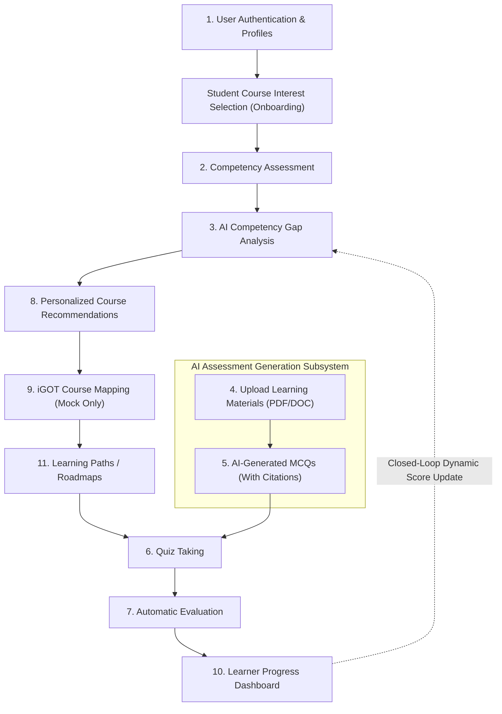

# MVP_FEATURES.md — Core MVP Features & Priority Matrix
## MoSPI AI-Powered Competency Intelligence & Learning Platform (SIH26101)

**Platform:** GyanMarg AI  
**Target:** Smart India Hackathon (SIH) 2026 — Ministry of Statistics & Programme Implementation (MoSPI)  
**Status:** 100% Implemented, Integrated & Verified (Core MVP Complete)  
**Priority Level:** P0 (Highest Execution Priority)

---

## 1. Executive Summary

This document defines the **11 Non-Negotiable Core MVP Features** that constitute the functional demo for the Smart India Hackathon. All architectural, design, and development tasks must prioritize these 11 features before any secondary or extended capabilities are built.

The core MVP establishes the complete closed-loop cycle:
$$\text{Authenticate} \longrightarrow \text{Assess Baseline} \longrightarrow \text{Quantify Gaps} \longrightarrow \text{Recommend Paths (iGOT)} \longrightarrow \text{Ingest Docs \& Gen MCQs} \longrightarrow \text{Quiz \& Auto-Evaluate} \longrightarrow \text{Update Progress}$$

### Core MVP Features Delivery Status: 11 / 11 Complete (100%)

| # | Feature | Status | Primary Implementation File |
| :-: | :--- | :---: | :--- |
| **1** | User Authentication & Profiles | ✅ Complete | [`src/context/AuthContext.tsx`](file:///e:/SIH_2026/igotkarmayogiclone/src/context/AuthContext.tsx), [`Login.tsx`](file:///e:/SIH_2026/igotkarmayogiclone/src/pages/Login.tsx) |
| **2** | Competency Assessment Interface | ✅ Complete | [`src/pages/student/Assessment.tsx`](file:///e:/SIH_2026/igotkarmayogiclone/src/pages/student/Assessment.tsx) |
| **3** | AI Competency Gap Analysis | ✅ Complete | [`src/pages/student/GapAnalysis.tsx`](file:///e:/SIH_2026/igotkarmayogiclone/src/pages/student/GapAnalysis.tsx) |
| **4** | Upload Learning Materials (PDF/DOC) | ✅ Complete | [`src/pages/admin/AssessmentManagement.tsx`](file:///e:/SIH_2026/igotkarmayogiclone/src/pages/admin/AssessmentManagement.tsx) |
| **5** | AI-Generated MCQs (With Citations & HITL) | ✅ Complete | [`src/pages/admin/AssessmentManagement.tsx`](file:///e:/SIH_2026/igotkarmayogiclone/src/pages/admin/AssessmentManagement.tsx) |
| **6** | Quiz Taking (Interactive Module Check) | ✅ Complete | [`src/pages/student/LearningInterface.tsx`](file:///e:/SIH_2026/igotkarmayogiclone/src/pages/student/LearningInterface.tsx) |
| **7** | Automatic Evaluation & Instant Feedback | ✅ Complete | [`AssessmentResults.tsx`](file:///e:/SIH_2026/igotkarmayogiclone/src/pages/student/AssessmentResults.tsx), [`LearningInterface.tsx`](file:///e:/SIH_2026/igotkarmayogiclone/src/pages/student/LearningInterface.tsx) |
| **8** | Personalized Course Recommendations | ✅ Complete | [`src/pages/student/CourseDiscovery.tsx`](file:///e:/SIH_2026/igotkarmayogiclone/src/pages/student/CourseDiscovery.tsx) |
| **9** | iGOT Course / Resource Mapping | ✅ Complete | [`src/data/igotCourses.ts`](file:///e:/SIH_2026/igotkarmayogiclone/src/data/igotCourses.ts), [`CourseDetails.tsx`](file:///e:/SIH_2026/igotkarmayogiclone/src/pages/student/CourseDetails.tsx) |
| **10**| Learner Progress Dashboard (Skill Health) | ✅ Complete | [`src/pages/student/Dashboard.tsx`](file:///e:/SIH_2026/igotkarmayogiclone/src/pages/student/Dashboard.tsx) |
| **11**| Learning Paths / Roadmaps (roadmap.sh) | ✅ Complete | [`src/pages/student/LearningPath.tsx`](file:///e:/SIH_2026/igotkarmayogiclone/src/pages/student/LearningPath.tsx) |

---

## 2. The 11 Core MVP Features

---

### Feature 1: User Authentication, Profiles & Course Interest Onboarding
- **Role-Based Access Control (RBAC):** Distinct authentication states for **Learners** (Statistical Officers / Trainees) and **Administrators** (MoSPI / DIID / NSSTA Faculty).
- **Authentication Methods:** Email/password authentication, live Google OAuth 2.0 integration, and instant 1-click Demo Account switchers for jury evaluation.
- **Learner Profiles:** Captures user metadata including full name, designation/cadre (e.g., Statistical Officer, Senior Statistical Officer), posting/division (FOD, SDRD, NAD, ESD), target career track, target achievement year, and persisted interested course preferences.
- **Student Course Selection Onboarding (`/student/interested-courses`):** Dedicated calibration step between authentication and dashboard entry. Supports persistent storage in Supabase and session-level onboarding presentation (`sessionStorage`) for repeated jury testing.
- **Route Protection:** Branded route guards (`ProtectedRoute`) securing student and administrative portals and redirecting unboarded student sessions.

### Feature 2: Competency Assessment
- **Baseline Diagnostic Engine:** Comprehensive diagnostic testing evaluating initial functional competency across core statistical domains.
- **FrAC Model Alignment:** Aligned with the official Karmayogi Framework for Roles, Activities, and Competencies (Domain, Functional, and Behavioral).
- **Core Tested Domains:**
  1. *Applied Statistics & Sampling Theory* (Stratified sampling, non-sampling errors).
  2. *SQL & Database Operations* (Window functions, aggregation for CPI/IIP).
  3. *Python & Data Analytics* (Microdata validation, Pandas, NumPy).
  4. *GIS & Spatial Analysis* (Spatial sampling frames, geo-tagging).
  5. *Public Data Ethics & DPDP Act 2023* (Data confidentiality, anonymization).
- **Time-bound Test Interface:** Clean, focused assessment environment with countdown timer, question navigation grid, and domain categorization.

### Feature 3: AI Competency Gap Analysis
- **Deterministic Gap Formulation:**
  $$\text{Competency Gap} = \max(0, \text{Target Role Benchmark} - \text{Current Demonstrated Score})$$
- **Severity Categorization:**
  - 🔴 **Critical Gap:** Variance $> 25\%$ (Requires immediate remediation).
  - 🟡 **Minor Gap:** Variance between $10\%$ and $25\%$ (Requires micro-learning).
  - 🟢 **Met Benchmark:** Variance $< 10\%$ (Benchmark satisfied).
- **Interactive Competency Radar Chart:** Visual multi-axis chart comparing current baseline vs. target role benchmarks across all 5 statistical domains.
- **Gap Matrix Table:** Structured breakdown listing domain, current score, required benchmark, net gap, and priority remediation actions.

### Feature 4: Upload Learning Materials (PDF/DOC)
- **Document Ingestion:** Admin and Faculty interface to upload official training materials, circulars, syllabi, and methodology guidelines (e.g., *"MoSPI Sampling Techniques Manual.pdf"*, *"National Accounts Statistics Guide.docx"*).
- **File Metadata & Parsing:** Validates file formats, parses textual content, and breaks materials down by chapter, section, and page references.

### Feature 5: AI-Generated MCQs (With Citations)
- **Automated Generation Engine:** Transforms ingested learning materials into high-quality statistical questions, single-choice MCQs, and scenario-based case questions.
- **Strict Schema Outputs:** Formats questions with:
  - Clear question stem and context.
  - 4 plausible options with one unambiguously correct choice.
  - Detailed explanation/rationale for the correct answer.
- **Verifiable Document Citations:** Every generated question includes the exact **Document Name**, **Chapter**, and **Page/Section Number** (guaranteeing zero hallucination).
- **Human-in-the-Loop (HITL) Review:** Admins/faculty can review, modify, approve, reject, or publish generated questions to the learner quiz bank.

### Feature 6: Quiz Taking
- **Dedicated Quiz Environment:** Interactive testing interface for learners to practice topics and validate module mastery.
- **Features:** Single-question and multi-question modes, option selection, bookmarking, and clear submission review.
- **Responsive Layout:** Distraction-free test screen optimized for desktop and tablet form factors.

### Feature 7: Automatic Evaluation
- **Instant Grading Engine:** Server/client deterministic grading executing immediately upon test submission.
- **Granular Feedback Breakdown:**
  - Overall score and percentage.
  - Domain-by-domain proficiency breakdown.
  - Question-by-question review highlighting correct answers, user choices, detailed rationales, and source document citations.
- **Dynamic Score Update:** Immediately propagates updated scores back to the learner's competency profile and gap analysis.

### Feature 8: Personalized Course Recommendations
- **Gap-Driven Recommendation Engine:** Matches the learner's critical competency deficits to specific remedial courses.
- **Priority Weighting:** Courses mapped to the largest measured skill gaps are prioritized at the top of the recommendation feed.
- **Clear Justification:** Explains *why* each course is recommended (e.g., *"Bridges your 35% critical gap in GIS & Spatial Analysis"*).

### Feature 9: iGOT Course / Resource Mapping (Mock Only)
- **Curated Catalog:** 20+ specialized courses reflecting real-world iGOT Karmayogi civil service capacity-building programs.
- **TPAC & NSSTA Integration:** Prominent badges indicating endorsement by the **Training Programme Advisory Committee (TPAC)** of the **National Statistical Systems Training Academy (NSSTA)**.
- **Mock Deep-Link Metadata:** Displays course duration, provider, competencies addressed, enrollment status, and simulated deep-link action buttons.

### Feature 10: Learner Progress Dashboard
- **Comprehensive Executive Overview:**
  - **Skill Health Score:** Real-time composite index (0–100%) indicating overall readiness for assigned statistical duties.
  - **Weekly Velocity / Progress Trend:** Visual progression chart tracking competency improvement over time.
  - **Active Modules & Upcoming Deadlines:** Clear cards showing in-progress courses, completion percentages, and scheduled assessments.
  - **Recent Milestones & Achievements:** Activity logs capturing completed lessons, passed quizzes, and earned achievements.

### Feature 11: Learning Paths / Roadmaps
- **Multi-Phase Structured Curriculum:** Sequenced 4-phase roadmap:
  - *Phase 1:* Foundation (Core ethical & data principles).
  - *Phase 2:* Critical Remediation (Targeted courses bridging the largest identified gaps).
  - *Phase 3:* Advanced Statistical Applications (GIS, ML, Big Data operations).
  - *Phase 4:* Certification & Verification.
- **Interactive Milestone Timeline:** Displays estimated duration (e.g., 12 Weeks), total courses, locked/unlocked states, and direct "Start" / "Continue" action buttons.

---

## 3. MVP Scope vs. Non-MVP Features

| Feature Domain | Core MVP Scope (P0 - In Scope) | Post-MVP / Production (Deferred) |
| :--- | :--- | :--- |
| **Authentication** | Email/Password, Google OAuth, 1-Click Role Switcher | Production Parichay / NIC SSO Enterprise Gateway |
| **Competency Framework** | 5 Core MoSPI FrAC Domains | Full Multi-Cadre Hierarchy (ISS, SSS, Subordinate) |
| **Assessment & Quizzes** | Diagnostic Test, Practice Quizzes, Auto-Grading | Adaptive Computerized Testing (CAT), Proctoring |
| **Document Ingestion** | Upload PDF/DOC + Extract Text/Chapters | Multi-GB Video Audio Transcription, OCR handwriting |
| **AI Question Gen** | LLM MCQ Gen + Exact Page Citations + HITL Review | Multi-modal diagram question generation |
| **Course Catalog** | Mock Curated iGOT & NSSTA Catalog (20+ courses) | Live two-way iGOT Karmayogi API sync & webhooks |
| **Learning Path** | Dynamic 4-Phase Roadmap prioritized by gap severity | AI real-time dynamic re-routing after every click |
| **Dashboards** | Learner Progress Dashboard + Admin Capacity Heatmap | Predictive attrition modeling & national drill-downs |

---

## 4. Verification & Demo Criteria

The MVP is successful and demo-ready when a jury can observe this unbroken end-to-end user journey in under 5 minutes:
1. **Login & Profile Setup** (Feature 1)
2. **Take Diagnostic Assessment** (Feature 2)
3. **Review Instant Auto-Evaluation** (Feature 7)
4. **Inspect Competency Gap Analysis & Radar Chart** (Feature 3)
5. **Explore Personalized Roadmap & iGOT Catalog** (Features 8, 9, 11)
6. **Switch to Admin Portal & Ingest MoSPI PDF** (Feature 4)
7. **Generate AI MCQs with Page Citations & Approve in HITL** (Feature 5)
8. **Take Generated Quiz & Observe Score Increase on Dashboard** (Features 6, 7, 10)
