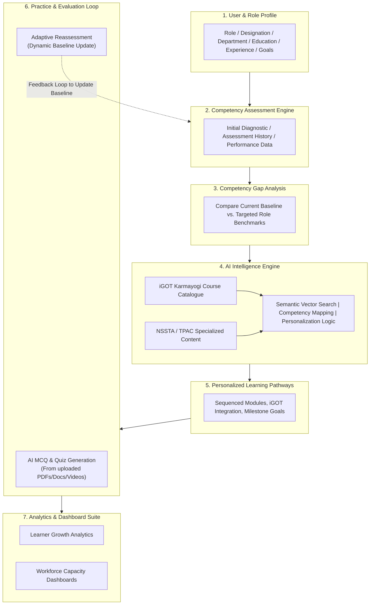

# Smart India Hackathon (SIH) 2026 — Problem Statement Analysis
## Problem Statement ID: SIH26101

---

### Project Metadata
| Attribute | Details |
| :--- | :--- |
| **Platform Title** | AI-Powered Competency Intelligence & Learning Platform |
| **Category** | Software |
| **Theme** | Smart Education |
| **Target Organization** | Ministry of Statistics & Programme Implementation (MoSPI) |
| **Target Department** | Data Informatics & Innovation Division (DIID) |
| **Affiliated Bodies** | National Statistical Systems Training Academy (NSSTA), Training Programme Advisory Committee (TPAC) |
| **Ecosystem Integration** | iGOT Karmayogi (Mission Karmayogi - National Programme for Civil Services Capacity Building) |

---

## 1. Problem Statement Overview

### Official Title
> *"Develop an AI enabled learning platform that identifies competency gaps, recommends personalized training through integration with the iGOT Karmayogi ecosystem, and capable of generating Quizzes and Multiple choice questions (MCQs) from uploaded learning materials to strengthen capacity building in India's Official Statistical System."*

### 1.1 Strategic Background & Context
India's Official Statistical System—anchored by the Ministry of Statistics & Programme Implementation (MoSPI) and regional statistical directorates—is undergoing a rapid structural digital transformation. Modern survey data collection, national accounts, CPI/IIP calculations, and predictive socioeconomic indicators are shifting toward high-tech data science paradigms:
- **Artificial Intelligence (AI) & Machine Learning (ML)** for automated data validation, imputation, and time-series forecasting.
- **Big Data Analytics & Data Engineering** to handle massive administrative datasets, digital registers, and high-frequency economic trackers.
- **Geographic Information Systems (GIS) & Spatial Analytics** for geo-tagged survey enumeration, spatial sampling, and satellite imagery integration.
- **Cloud Computing & Modern IT Infrastructure** for distributed high-performance statistical computing.
- **Advanced Modern Statistical Methodologies** for Bayesian inference, synthetic population modeling, and non-sampling error reduction.

To keep pace with these evolving standards, personnel across the entire statistical value chain—ranging from field primary investigators and data collectors to senior data analysts, data processors, and high-level policy advisors—require continuous, targeted upskilling.

---

## 2. Core Problem Analysis & The Critical Gap

### 2.1 The Friction in Capacity Building
Although the government's **iGOT Karmayogi** platform provides thousands of courses, statistical personnel encounter severe friction in identifying and consuming the right training. The critical gap is fourfold:

1. **Current Role Requirements:** Unclear mapping of precise technical capabilities needed for the officer's exact current posting (e.g., National Sample Survey vs. National Accounts Division).
2. **Existing Competency Baseline:** Lack of reliable diagnostic baselining; completed course counts do not measure true functional competency.
3. **Future Responsibilities & Career Trajectory:** Inability to proactively acquire emerging technical skills required for upcoming promotions, deputations, or specialized project shifts.
4. **Departmental Priorities:** Difficulty in aligning individual learning goals with macro organizational shifts (e.g., MoSPI's shift from manual paper sampling to AI-driven GIS sampling).

> **Core Thesis:**
> *"We have extensive learning resources, but we lack an intelligent layer connecting the right learner to the right learning at the right time."*

### 2.2 Illustrative Competency Gap Scenario
**Case Profile:** Statistical Officer transitioning to a *Data Science & GIS Analyst* role:

| Skill Domain | Current Competency | Target Role Benchmark | Status / Gap Severity | Remediation Action |
| :--- | :---: | :---: | :--- | :--- |
| **Python Programming** | 80% | 80% | 🟢 **Met Benchmark** | Maintain / Advanced electives |
| **Applied Statistics** | 65% | 75% | 🟡 **Minor Gap (-10%)** | Targeted micro-modules |
| **SQL & Database Ops** | 40% | 70% | 🔴 **Critical Gap (-30%)** | Priority foundational course |
| **GIS & Spatial Analysis** | 25% | 60% | 🔴 **Critical Gap (-35%)** | Core hands-on training |
| **Data Analytics & ML** | 50% | 80% | 🔴 **Critical Gap (-30%)** | Core theoretical & lab course |

**Platform Execution Workflow:**
$$\text{Determine Gaps} \longrightarrow \text{Prioritize Criticality} \longrightarrow \text{Map iGOT / NSSTA Courses} \longrightarrow \text{Generate Adaptive Path}$$

---

## 3. Functional Architecture & Core Capabilities



---

## 4. Detailed Technical Breakdown of Platform Modules

### Module 1: Profile & Baseline Management
- **Data Sources:** Designation, current assignment, past training records, educational qualifications, career aspirations.
- **Competency Framework:** Strictly aligned with the official Karmayogi Competency Model (**FrAC Framework - Framework for Roles, Activities, and Competencies**) across three tiers:
  1. *Domain Competencies* (Official statistics, sampling theory, national accounts, price indices).
  2. *Functional Competencies* (Data visualization, SQL, Python, GIS software, econometric modeling).
  3. *Behavioral Competencies* (Data ethics, analytical mindset, leadership, inter-departmental collaboration).

### Module 2: AI Recommendation & Mapping Engine
- **Semantic Search & Vector Embeddings:** Converts unstructured course descriptions, syllabi, and official job descriptions into dense high-dimensional vector spaces using LLM embeddings (e.g., text-embedding-3 / BGE) stored in vector stores (FAISS / Pgvector / ChromaDB).
- **Smart Matching Algorithm:** Calculates cosine similarity between learner gaps and iGOT / NSSTA course learning objectives to recommend exact course sequences.
- **TPAC Integration:** Specifically prioritizes and flags courses recommended by the **Training Programme Advisory Committee (TPAC)** from the **National Statistical Systems Training Academy (NSSTA)**.

### Module 3: AI-Powered Intelligent Assessment Engine
- **Multimodal Content Ingestion:** Ingests official statistical training manuals, PDFs, DOCX files, presentations, and lecture video transcripts (e.g., *"Introduction to Sampling Techniques.pdf"*).
- **Automated Generation with Strict Schema Control:** Employs LLMs with structured JSON schema outputs to produce:
  - Standard Single-Choice MCQs
  - Multi-select & Scenario-based Statistical Case Quizzes
  - Comprehensive rationales and explanations
  - **Exact source page/section citations** ensuring zero hallucination.
- **Human-in-the-Loop (HITL) Workflow:** Trainers, NSSTA faculty, and DIID administrators can review, modify, approve, reject, or regenerate generated question pools before publishing.

### Module 4: Continuous Learning & Dynamic Progression
Closed-loop adaptive learning mechanism:
```
[ ASSESS ] ──► [ IDENTIFY GAPS ] ──► [ RECOMMEND (iGOT) ] ──► [ LEARN ]
    ▲                                                              │
    │                                                              ▼
[ UPDATE PROFILE ] ◄── [ REASSESS ] ◄── [ PRACTICE (AI QUIZ) ] ◄───┘
```
As learners complete quizzes and training modules, their baseline competency scores dynamically increase, closing the measured gap in real time.

---

## 5. Stakeholder Dashboards

### 5.1 Learner Dashboard
- **Competency Radar Chart:** Visual multi-axis comparison of the officer's current skill profile vs. target role benchmarks.
- **Personalized Learning Path:** Sequenced, ordered list of iGOT and NSSTA modules with estimated completion timelines and difficulty ratings.
- **Skill Health Score:** Real-time composite metric (0–100%) indicating overall technical readiness for assigned statistical projects.
- **AI Statistical Tutor / Mentor:** Context-aware interactive assistant trained to answer domain-specific questions on sampling, formulas, and statistical frameworks.

### 5.2 Administrator & Workforce Analytics Dashboard (MoSPI / DIID / NSSTA)
- **Macro Capacity Heatmaps:** Aggregated competency mapping across regional offices (FOD - Field Operations Division, SDRD, NAD, ESD, etc.).
- **Predictive Skill Shortage Alerts:** Early-warning analytics highlighting institutional deficits in critical emerging domains (e.g., Big Data engineering, GIS-based frame creation).
- **Training ROI & Completion Metrics:** Institutional metrics tracking enrollment, completion velocity, post-training assessment gains, and average time-to-proficiency.
- **Course Effectiveness Index:** Empirical rating system identifying which iGOT/NSSTA courses deliver the highest measurable competency improvements.

---

## 6. UX & Design Strategy

- **Target Tone:** Enterprise credibility combined with modern, intuitive EdTech usability.
- **Visual Palette:** Clean, professional government design language featuring:
  - Deep Navy Blue (`#0F172A` / `#1E3A8A`) — Authority, stability
  - Warm Cream / Off-White (`#F8FAFC` / `#FFFDF9`) — Readability, elegance
  - Gold / Amber Accents (`#D97706` / `#F59E0B`) — Distinction, achievement
  - Cool Slate Grey (`#64748B` / `#334155`) — Balanced data density
- **Interface Principles:** High data density without visual clutter, accessible typography, mobile-responsive layout, and strict adherence to **WCAG 2.1 AA** accessibility guidelines.

---

## 7. Security, Scalability & Compliance

- **Authentication & Access:** Granular Role-Based Access Control (RBAC) integrated with Single Sign-On (**Parichay / NIC SSO**) for government officers.
- **Data Security & Privacy:** End-to-end encryption in transit (TLS 1.3) and at rest (AES-256), adhering strictly to the **Digital Personal Data Protection (DPDP) Act** and Indian Government Cybersecurity Frameworks (CERT-In).
- **API-First Architecture:** Microservices architecture using RESTful and gRPC interfaces for modular integration with iGOT Karmayogi APIs and MoSPI internal HRMS/e-Office systems.
