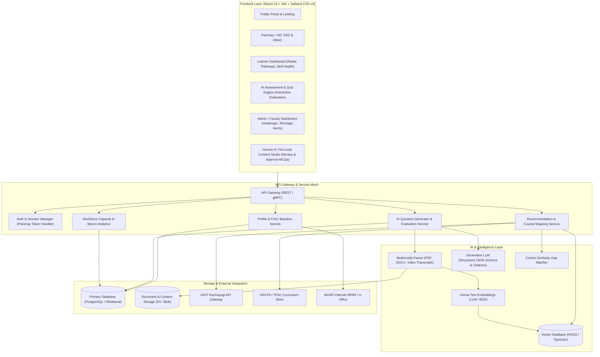

# Technical Architecture & System Specifications
## MoSPI AI-Powered Competency Intelligence & Learning Platform (SIH26101)

This specification outlines the technical contracts, data schemas, algorithms, and architectural layers supporting the AI-Powered Competency Intelligence & Learning Platform for the Ministry of Statistics & Programme Implementation (MoSPI).

---

## 1. System Architecture Diagram



---

## 2. FrAC Framework Data Model (Karmayogi Standard)

The platform adopts the **Framework for Roles, Activities, and Competencies (FrAC)** standardized under Mission Karmayogi:

```json
{
  "user_id": "mospi_usr_84920",
  "name": "Arun Kumar",
  "cadre": "Indian Statistical Service (ISS) / SSS",
  "designation": "Statistical Officer",
  "current_division": "Field Operations Division (FOD), Kolkata",
  "target_role": {
    "role_id": "role_ds_gis_01",
    "title": "Data Science & GIS Spatial Analyst",
    "required_competencies": [
      {
        "competency_id": "comp_python_01",
        "name": "Python for Statistical Computing",
        "type": "FUNCTIONAL",
        "target_score": 80,
        "criticality": "HIGH"
      },
      {
        "competency_id": "comp_stat_02",
        "name": "Applied Sampling Methodologies",
        "type": "DOMAIN",
        "target_score": 75,
        "criticality": "MEDIUM"
      },
      {
        "competency_id": "comp_sql_03",
        "name": "Relational Databases & SQL Analytics",
        "type": "FUNCTIONAL",
        "target_score": 70,
        "criticality": "HIGH"
      },
      {
        "competency_id": "comp_gis_04",
        "name": "GIS & Spatial Sampling",
        "type": "DOMAIN",
        "target_score": 60,
        "criticality": "HIGH"
      },
      {
        "competency_id": "comp_ml_05",
        "name": "Machine Learning & Predictive Modeling",
        "type": "DOMAIN",
        "target_score": 80,
        "criticality": "CRITICAL"
      }
    ]
  },
  "current_competency_profile": {
    "comp_python_01": 80,
    "comp_stat_02": 65,
    "comp_sql_03": 40,
    "comp_gis_04": 25,
    "comp_ml_05": 50
  }
}
```

---

## 3. Competency Gap Analysis & Mapping Formula

1. **Gap Metric ($\Delta C_i$):**
   $$\Delta C_i = \max(0, \text{TargetScore}_i - \text{CurrentScore}_i)$$
   
2. **Prioritization Weight ($W_i$):**
   $$W_i = \text{CriticalityFactor}_i \times \Delta C_i$$
   *(Where CriticalityFactor: CRITICAL=1.5, HIGH=1.2, MEDIUM=1.0, LOW=0.7)*

3. **Semantic Course Matching:**
   $$\text{Score}(\text{LearnerGap}_i, \text{Course}_k) = \cos(\mathbf{e}_{\text{gap}_i}, \mathbf{e}_{\text{course}_k}) \times \text{TPAC\_Bonus}$$
   *(TPAC_Bonus = 1.25 if the course is endorsed by NSSTA TPAC)*

---

## 4. AI Assessment Engine & Strict JSON Schema

When generating quizzes from uploaded materials (e.g. *Sampling Methods.pdf*), the LLM must enforce the following strict schema:

```json
{
  "$schema": "http://json-schema.org/draft-07/schema#",
  "title": "AIQuizGenerationSchema",
  "type": "object",
  "properties": {
    "quiz_id": { "type": "string" },
    "source_document": { "type": "string" },
    "questions": {
      "type": "array",
      "items": {
        "type": "object",
        "properties": {
          "id": { "type": "string" },
          "question_type": { "enum": ["single_choice", "multiple_choice", "scenario_based"] },
          "competency_tag": { "type": "string" },
          "difficulty": { "enum": ["beginner", "intermediate", "advanced"] },
          "question_text": { "type": "string" },
          "options": {
            "type": "array",
            "items": {
              "type": "object",
              "properties": {
                "key": { "type": "string" },
                "text": { "type": "string" }
              },
              "required": ["key", "text"]
            }
          },
          "correct_keys": { "type": "array", "items": { "type": "string" } },
          "explanation": { "type": "string" },
          "citation": {
            "type": "object",
            "properties": {
              "document_name": { "type": "string" },
              "page_number": { "type": "integer" },
              "section_header": { "type": "string" },
              "excerpt": { "type": "string" }
            },
            "required": ["document_name", "page_number", "excerpt"]
          }
        },
        "required": ["id", "question_type", "competency_tag", "question_text", "options", "correct_keys", "explanation", "citation"]
      }
    }
  },
  "required": ["quiz_id", "source_document", "questions"]
}
```

---

## 5. Security & Government Compliance Protocols

1. **Parichay / NIC SSO:** Authentication utilizes OAuth2 / SAML 2.0 assertions delivered by the National Informatics Centre (NIC) Single Sign-On gateway.
2. **Data Protection & Storage Sovereignty:** All data is hosted within Indian sovereign cloud infrastructure (MeitY empaneled cloud providers), strictly compliant with CERT-In directives and the DPDP Act 2023.
3. **Transport & Storage Encryption:**
   - Transport: TLS 1.3 only, enforcing modern cipher suites (`AES_256_GCM_SHA384`, `CHACHA20_POLY1305_SHA256`).
   - At Rest: AES-256 with hardware security module (HSM) managed keys.
4. **Audit Trails & Non-Repudiation:** Tamper-evident logging of assessment attempts, scores, and faculty question approvals for administrative transparency.
